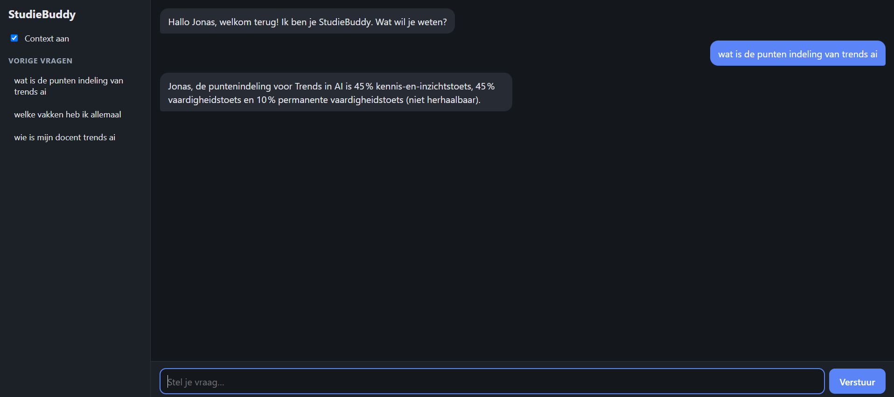

# StudieBuddy



Een AI-studieassistent die je vragen beantwoordt over je vakken, op basis van je eigen ECTS-fiches. Hij onthoudt je naam en vorige vragen tussen sessies.

- **LLM-provider:** [Groq](https://console.groq.com/)
- **Model:** `openai/gpt-oss-120b`

## Opzetten

1. Installeer de afhankelijkheden:

   ```bash
   pip install -r requirements.txt
   ```

2. Maak een `.env` bestand aan in deze map met je Groq API key (gratis via [console.groq.com/keys](https://console.groq.com/keys)):

   ```
   GROQ_API_KEY=jouw_api_key_hier
   ```

## Voor je eigen vakken

Zet je vakken in de map `context/`: één submap per vak, met de ECTS-fiche als `.md` bestand erin.

```
context/
  Mijn_Vak/
    ects_fiche_mijn_vak.md
  Ander_Vak/
    ects_fiche_ander_vak.md
```

## Uitvoeren

- **Terminal:** `python assistent.py` (typ `/stop` om te stoppen)
- **Webinterface:** `python app.py` en open http://127.0.0.1:5000

> [!WARNING]
> Limieten van het gratis Groq-account voor dit model:
> - **30** berichten per minuut en **1000** per dag
> - **8000** tokens per minuut en **200.000** per dag
>
> Bij een `Groq-fout` even wachten en opnieuw proberen. Daarom worden maximaal 2 ECTS-fiches tegelijk meegestuurd.
